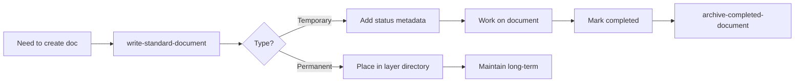

# AI Documentation Workflow Guide

**For**: Claude Code AI Agent
**Purpose**: Ensure ALL documentation created by AI follows project standards
**Version**: 1.0
**Date**: 2025-11-26

---

## Core Principle

**ALWAYS use the `write-standard-document` skill when creating ANY markdown file in `docs/` directory.**

## Workflow Rules

### Rule 1: Mandatory Skill Usage

When you (Claude) need to create a document in `docs/`:

```
❌ WRONG:
Write tool → docs/analysis-results.md

✅ CORRECT:
Invoke write-standard-document skill → Skill creates docs/analysis-results.md
```

### Rule 2: Document Type Detection

Before creating, determine the document type:

| If you're creating... | Type | Use template |
|----------------------|------|--------------|
| API documentation | spec | Technical Specification |
| Analysis results | temp | Temporary Document |
| Migration plan | temp | Temporary Document |
| User guide | guide | User/Dev Guide |
| Architecture decision | adr | ADR Template |
| Business knowledge | wiki | Wiki Template |

### Rule 3: Self-Service Workflow

**Step 1**: Recognize you need to create a document
```
Example: "I've completed the analysis, I should document the findings"
```

**Step 2**: Invoke the skill
```
Thought: "I need to create an analysis document. I must use write-standard-document skill."
Action: Invoke write-standard-document skill
```

**Step 3**: Provide context to the skill
```
Internal parameters:
- Document purpose: "Analysis of database migration safety"
- Intended type: "temp" (temporary analysis)
- Key content: Migration findings, risks, recommendations
```

**Step 4**: Let the skill handle creation
```
Skill will:
- Choose temporary document template
- Add metadata (status: in progress, completion date, etc.)
- Suggest filename: analysis-database-migration.md
- Create in docs/ root (for temp docs)
```

## Common Scenarios

### Scenario 1: Code Analysis Results

```
Task: User asks you to analyze code and document findings

❌ Wrong approach:
1. Analyze code
2. Write tool → docs/code-analysis.md
3. Add unstructured content

✅ Correct approach:
1. Analyze code
2. Invoke write-standard-document skill
3. Specify: type=temp, purpose="Code analysis findings"
4. Skill creates structured document with metadata
5. Fill in the analysis content
```

### Scenario 2: Creating API Documentation

```
Task: Document a new API endpoint you just implemented

❌ Wrong approach:
1. Write tool → docs/api-docs.md
2. Add basic API description

✅ Correct approach:
1. Invoke write-standard-document skill
2. Specify: type=spec, component="API", name="Authentication Endpoints"
3. Skill suggests: docs/1-specs/api/authentication.md
4. Skill creates template with proper sections
5. Fill in endpoint details, request/response formats
```

### Scenario 3: Migration Planning

```
Task: Create a migration plan for database refactoring

❌ Wrong approach:
1. Write tool → docs/migration-plan.md
2. Write plan content

✅ Correct approach:
1. Invoke write-standard-document skill
2. Specify: type=temp, purpose="Database migration plan"
3. Skill suggests: docs/migration-plan-database-refactoring.md
4. Skill adds metadata: status=in progress, completion date
5. Fill in migration steps and risks
6. When complete, mark status=completed
7. Use archive-completed-document skill to archive
```

## Integration with Other Skills

### Complete Document Lifecycle



### Skill Chain

1. **write-standard-document** - Initial creation
2. **analyze-temp-document** - Auto-classify if needed
3. **archive-completed-document** - Archive when done

## Enforcement Mechanism

### Self-Check Before Write

Before using Write tool for any `docs/*.md` file, ask yourself:

```
Q1: Is this a documentation file in docs/?
Q2: Should I use write-standard-document skill instead?
Q3: Have I invoked the skill?

If any answer is "yes" to Q1, then Q2 and Q3 must be "yes".
```

### Hook Reminder

The PreToolUse hook will remind you if you attempt to write directly:

```
Hook message:
"⚠️  Creating document in docs/ - Consider using write-standard-document skill"
```

## Examples of Skill Invocation

### Example 1: Implicit Self-Use

```
User: "Analyze the authentication system and document your findings"

Claude internal thought:
"I need to:
1. Analyze the auth system
2. Document findings
3. For step 2, I must use write-standard-document skill"

Claude:
[Analyzes code]
[Invokes write-standard-document skill]

Skill interaction (internal):
- Purpose: "Authentication system analysis"
- Type: temp
- Filename: analysis-authentication-system.md
- Template: Temporary document with status tracking

[Skill creates document]
[Claude fills in analysis findings]

Claude to user:
"I've analyzed the authentication system and documented the findings in
docs/analysis-authentication-system.md (Status: 🔄 In progress).

Key findings:
1. ...
2. ...

The document includes metadata for lifecycle tracking."
```

### Example 2: During Feature Development

```
User: "Implement user permissions system and document the API"

Claude internal thought:
"Tasks:
1. Implement permissions (code work)
2. Document the API
3. For API docs, I must use write-standard-document skill with type=spec"

[After implementation]

Claude:
[Invokes write-standard-document skill]
- Type: spec
- Component: API
- Name: "User Permissions API"
- Layer: 1-specs/api/

[Skill creates docs/1-specs/api/permissions.md]
[Claude fills in API endpoints, request/response formats]

Claude to user:
"✅ Implemented user permissions system
✅ Documented API in docs/1-specs/api/permissions.md

The API documentation includes:
- All endpoints
- Request/response schemas
- Permission validation rules
- Error codes"
```

## Benefits of This Approach

✅ **Consistency**: All docs follow same structure
✅ **Discoverability**: Proper placement in layer directories
✅ **Lifecycle Management**: Temporary docs are tracked and archived
✅ **Quality**: Complete metadata, cross-references, templates
✅ **Maintainability**: Standardized format easy to update

## Checklist for Claude

Before creating any document:

- [ ] Is this a `.md` file in `docs/`?
- [ ] Did I invoke `write-standard-document` skill?
- [ ] Did I specify the document type/purpose?
- [ ] Did I let the skill choose the template?
- [ ] Did I verify the suggested location is correct?

**If all yes**: Proceed with skill-created document
**If any no**: Stop and use the skill first

---

**Remember**: The `write-standard-document` skill is not optional for docs/ - it's the ONLY correct way to create documentation.
