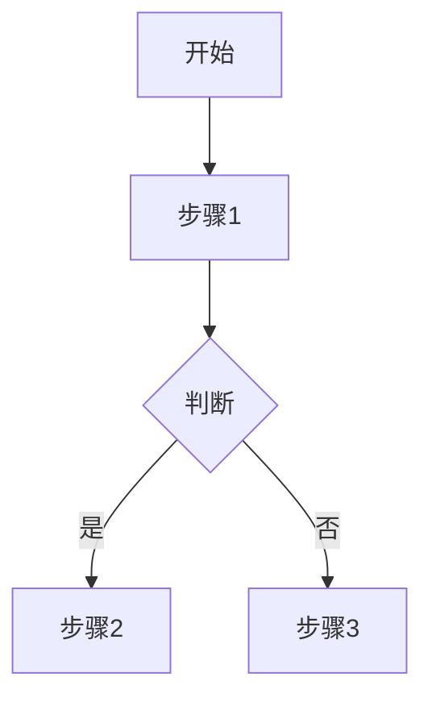

# Write Standard Document

**CRITICAL**: This skill is MANDATORY for all document creation in `docs/`. Claude must use this skill whether the user requests a document or Claude needs to create one during task execution.

Guide users (and Claude itself) through creating well-structured documents that comply with the project's seven-layer documentation architecture and standards defined in `docs/directory-standards.md`.

## When to Use This Skill

Claude **MUST** invoke this skill when:

### User-Initiated Creation
- User says "create a new document" or "write a new doc"
- User asks "how should I document..."
- User wants to add documentation but is unsure of the format
- User explicitly requests help with documentation standards
- User runs `/new-doc` command

### Claude-Initiated Creation (IMPORTANT)
- **Claude needs to create ANY .md file in `docs/` directory**
- Claude is documenting work performed (e.g., migration analysis, refactoring plan)
- Claude creates analysis reports, investigation summaries, or implementation plans
- Claude writes technical specifications, API docs, or guides
- Claude creates temporary documents for tracking tasks

**Rule**: NEVER use Write tool directly for `docs/*.md` files. ALWAYS use this skill instead.

## Task Overview

This skill helps users create properly structured documents by:
1. Understanding what needs to be documented
2. Choosing the correct document type and layer
3. Applying the appropriate template
4. Ensuring correct metadata and naming
5. Placing the document in the right location

## Step-by-Step Process

### Step 1: Understand User Intent

Ask the user what they want to document:

**Question to ask**: "What would you like to document?"

**Listen for keywords**:
- API, endpoint, interface, schema → Specs layer (1-specs)
- Requirements, features, user story, PRD → Requirements layer (2-requirements)
- Tutorial, how-to, guide, instructions → Guides layer (3-guides)
- Plan, roadmap, milestone, backlog → Planning layer (4-planning)
- Business logic, domain knowledge, how it works → Wiki layer (5-wiki)
- Decision, ADR, architecture choice → Decisions layer (6-decisions)
- Completed work, old design → Archive layer (7-archive)

### Step 2: Determine Document Type

Based on user intent, classify into one of these categories:

| Category | Layer | Directory | Examples |
|----------|-------|-----------|----------|
| **Technical Spec** | 1-specs | `docs/1-specs/` | API docs, DB schema, UI specs |
| **Product Requirement** | 2-requirements | `docs/2-requirements/` | PRD, user stories, designs |
| **User/Dev Guide** | 3-guides | `docs/3-guides/` | Tutorials, setup guides |
| **Planning Doc** | 4-planning | `docs/4-planning/` | Roadmaps, backlogs, sprints |
| **Business Wiki** | 5-wiki | `docs/5-wiki/` | Domain knowledge, mechanisms |
| **Architecture Decision** | 6-decisions | `docs/6-decisions/` | ADRs, design choices |
| **Temporary/Analysis** | docs/ root | `docs/` | Temp analysis, migration plans |

### Step 3: Ask Clarifying Questions

Use the AskUserQuestion tool to gather details:

**For Specs**:
- "What component/system are you documenting?" (backend/frontend/database/api)
- "Is this a new spec or updating existing?"

**For Requirements**:
- "Is this a PRD, user story, or design document?"
- "What feature/epic is this for?"

**For Guides**:
- "Who is the audience?" (users/developers/testers)
- "What's the main task you're teaching?"

**For Planning**:
- "What timeframe?" (sprint/quarter/year)
- "Is this a roadmap, backlog, or completed milestone?"

**For Wiki**:
- "What business domain/module?" (test management/workflow/permissions)

**For Decisions**:
- "What decision was made?"
- "What were the alternatives considered?"

### Step 4: Select Template

Based on document type, provide the appropriate template:

#### Template: Technical Specification

```markdown
# [Component/System Name] 技术规范

**版本**: 1.0
**最后更新**: YYYY-MM-DD
**维护者**: [Team Name]
**状态**: Draft / Review / Approved

---

## 概述

简要说明本规范涵盖的技术组件或系统。

## 技术架构

### 系统组件

描述主要组件和它们的关系。

### 技术栈

- 语言/框架
- 依赖库
- 工具链

## 接口定义

### API接口 (如适用)

#### Endpoint: `/api/v2/example`

**方法**: GET/POST/PUT/DELETE

**请求参数**:
```json
{
  "param1": "value",
  "param2": 123
}
```

**响应格式**:
```json
{
  "status": "success",
  "data": {}
}
```

### 数据模型 (如适用)

```
Entity:
  - field1: type
  - field2: type
```

## 实现细节

### 核心逻辑

### 错误处理

### 性能考虑

## 测试要求

- 单元测试覆盖率目标
- 集成测试场景
- 性能基准

## 部署说明

### 环境要求

### 配置参数

## 相关文档

- [链接到需求文档]
- [链接到架构决策]

---

**审核历史**:
- YYYY-MM-DD: 初始版本 - [Author]
```

#### Template: Product Requirement Document (PRD)

```markdown
# [Feature Name] 产品需求文档

**文档类型**: PRD
**版本**: 1.0
**创建日期**: YYYY-MM-DD
**产品负责人**: [Name]
**状态**: Draft / Review / Approved

---

## 1. 需求背景

### 业务目标

为什么需要这个功能？解决什么问题？

### 用户价值

给用户带来什么价值？

## 2. 功能概述

简要描述功能的核心内容（1-2段）。

## 3. 用户故事

**作为** [用户角色]
**我想要** [功能描述]
**以便** [达成目标]

**验收标准**:
- [ ] 标准1
- [ ] 标准2
- [ ] 标准3

## 4. 功能需求

### 4.1 核心功能

#### 功能点1

**需求描述**: 详细说明

**交互流程**:
1. 用户执行操作A
2. 系统响应B
3. 显示结果C

**UI设计** (如有):
- [链接到设计稿]

### 4.2 边界情况

- 场景1: 处理方式
- 场景2: 处理方式

## 5. 非功能需求

### 性能要求

- 响应时间 < Xms
- 并发支持 X用户

### 安全要求

### 兼容性要求

## 6. 技术约束

- 必须使用的技术
- 不能使用的技术
- 集成要求

## 7. 优先级

**优先级**: P0 / P1 / P2

**发布计划**: vX.Y.Z

## 8. 成功指标

- KPI 1: 目标值
- KPI 2: 目标值

## 9. 相关文档

- [技术规范](../1-specs/)
- [用户指南](../3-guides/)
- [架构决策](../6-decisions/)

---

**变更历史**:
- YYYY-MM-DD: 初始版本
```

#### Template: User/Developer Guide

```markdown
# [Task/Feature] 使用指南

**版本**: 1.0
**最后更新**: YYYY-MM-DD
**适用对象**: 用户 / 开发者 / 测试人员
**难度**: 初级 / 中级 / 高级

---

## 概述

简要说明本指南的目标和适用场景。

## 前置条件

使用本指南前需要：
- [ ] 条件1
- [ ] 条件2
- [ ] 条件3

## 快速开始

最简单的使用方式（5分钟内完成）：

```bash
# 步骤1
command1

# 步骤2
command2
```

## 详细步骤

### 步骤1: [描述]

**目标**: 完成XX操作

**操作**:
1. 打开/访问/运行...
2. 输入/选择...
3. 点击/执行...

**预期结果**: 应该看到...

**常见问题**:
- 问题1: 解决方案
- 问题2: 解决方案

### 步骤2: [描述]

重复上述结构...

## 高级用法

### 场景1: [描述]

### 场景2: [描述]

## 最佳实践

1. 建议1
2. 建议2
3. 建议3

## 故障排除

### 错误: [错误信息]

**原因**: 为什么会出现

**解决方法**:
1. 尝试方法1
2. 如果不行，尝试方法2

## 相关资源

- [相关技术文档](../1-specs/)
- [API文档]
- [视频教程链接]

---

**反馈**: 如有问题请联系 [Contact]
```

#### Template: Architecture Decision Record (ADR)

```markdown
# ADR-[NUMBER]: [Decision Title]

**日期**: YYYY-MM-DD
**状态**: Proposed / Accepted / Deprecated / Superseded
**决策者**: [Names]
**相关Issue/PR**: [Links]

---

## 背景 (Context)

描述需要做出决策的背景和问题。

为什么需要做这个决策？当前面临什么挑战？

## 决策 (Decision)

**我们决定**: [简明扼要地陈述决策]

## 考虑的方案 (Alternatives Considered)

### 方案1: [Name]

**描述**: 如何实现

**优点**:
- 优点1
- 优点2

**缺点**:
- 缺点1
- 缺点2

### 方案2: [Name]

**描述**: 如何实现

**优点**:
- 优点1

**缺点**:
- 缺点1

### 方案3: [选中的方案]

**描述**: 详细实现方式

**优点**:
- 优点1
- 优点2
- 优点3

**缺点**:
- 缺点1

**为什么选择这个方案**: 权衡考虑后的理由

## 影响 (Consequences)

### 积极影响

- 影响1
- 影响2

### 消极影响/风险

- 风险1: 缓解措施
- 风险2: 缓解措施

### 技术债务

是否引入技术债务？如何处理？

## 实施计划

- [ ] 任务1
- [ ] 任务2
- [ ] 任务3

**预计完成时间**: YYYY-MM-DD

## 参考资料

- [相关技术文档]
- [外部资源链接]
- [讨论记录]

---

**审核**: [Reviewer Names]
**批准**: [Approver Names]
```

#### Template: Business Wiki

```markdown
# [Business Domain/Module] 业务知识

**版本**: 1.0
**最后更新**: YYYY-MM-DD
**维护者**: [Team]

---

## 业务背景

为什么需要这个模块？解决什么业务问题？

## 核心概念

### 概念1: [名称]

**定义**: 清晰的定义

**示例**: 实际例子

**与其他概念的关系**: 说明关联

### 概念2: [名称]

重复上述结构...

## 业务规则

### 规则1: [描述]

**适用场景**: 什么时候应用这个规则

**规则说明**: 详细的规则内容

**例外情况**: 什么情况下不适用

### 规则2: [描述]

重复...

## 运作机制

### 流程1: [名称]

**触发条件**: 什么时候启动

**步骤**:
1. 步骤1说明
2. 步骤2说明
3. 步骤3说明

**流程图**:


## 数据模型

### 实体1

**属性**:
- 属性1: 类型, 说明
- 属性2: 类型, 说明

**关系**:
- 与实体2: 一对多关系

## 常见场景

### 场景1: [描述]

**问题**: 用户想要做什么

**解决方案**: 系统如何处理

**注意事项**: 特殊情况说明

## 常见问题 (FAQ)

**Q1: [问题]**
A: [答案]

**Q2: [问题]**
A: [答案]

## 相关文档

- [技术实现](../../1-specs/)
- [产品需求](../../2-requirements/)
- [操作指南](../../3-guides/)

---

**贡献者**: [List of contributors]
```

#### Template: Temporary Document (Analysis/Plan)

```markdown
# [Task/Analysis Name]

**文档类型**: 临时文档
**清理规则**: 完成后归档到 `docs/7-archive/`
**状态**: 🔄 进行中
**创建时间**: YYYY-MM-DD
**预计完成**: YYYY-MM-DD
**负责人**: [Name]

---

## 背景

为什么需要这个分析/计划？

## 目标

- [ ] 目标1
- [ ] 目标2
- [ ] 目标3

## 分析内容 / 计划步骤

### 1. [第一部分]

**分析/任务**:
- 内容...

**发现/结果**:
- 发现1
- 发现2

### 2. [第二部分]

重复...

## 结论/行动项

### 关键发现

1. 发现1
2. 发现2

### 后续行动

- [ ] 行动1 - 负责人, 截止日期
- [ ] 行动2 - 负责人, 截止日期

## 相关资源

- [相关文档链接]

---

**完成标准**:
完成所有目标后，将状态改为 "✅ 已完成"，然后运行 `/cleanup-docs archive`
```

### Step 5: Suggest File Name and Location

Based on document type and user input, suggest:

**Naming Convention**:
- Use lowercase with hyphens: `my-document-name.md`
- Be descriptive but concise
- Include version if applicable: `api-v2-documentation.md`
- Follow layer-specific patterns

**Directory Suggestions**:

| Document Type | Suggested Path |
|---------------|----------------|
| API Spec | `docs/1-specs/api/[name].md` |
| Database Schema | `docs/1-specs/database/[name].md` |
| PRD | `docs/2-requirements/prd/[name].md` |
| User Story | `docs/2-requirements/stories/[name].md` |
| User Guide | `docs/3-guides/user/[name].md` |
| Dev Guide | `docs/3-guides/development/[name].md` |
| Roadmap | `docs/4-planning/roadmap/[name].md` |
| Backlog | `docs/4-planning/backlog/[name].md` |
| Business Wiki | `docs/5-wiki/business/[name].md` |
| ADR | `docs/6-decisions/adr/adr-[number]-[name].md` |
| Temp Analysis | `docs/analysis-[name].md` |
| Temp Plan | `docs/todo-[name].md` |

### Step 6: Create Document

Fill in the template with information gathered from the user:
1. Replace placeholders with actual values
2. Add current date
3. Include user-provided content
4. Ensure all metadata is complete

### Step 7: Verify and Confirm

Before writing the file:
1. Show the user the proposed file path
2. Show a preview of the document structure
3. Confirm: "Should I create this document at `[path]`?"
4. Wait for user confirmation

### Step 8: Post-Creation Guidance

After creating the document:

```
✅ Document created successfully!

📄 File: [path]
📁 Layer: [layer name]
📋 Type: [document type]

Next steps:
1. Fill in the [specific sections] with your content
2. Review the metadata at the top
3. Run git add when ready to commit

Related commands:
- /cleanup-docs check - View document status
- git status - Check git staging area
```

## Special Cases

### Case 1: User Wants to Update Existing Document

If user wants to update rather than create:
1. Read the existing document
2. Confirm it follows current standards
3. Suggest improvements if needed
4. Help add missing sections

### Case 2: User is Unsure of Document Type

If classification is unclear:
1. Describe the seven-layer architecture
2. Provide examples of each layer
3. Ask follow-up questions to clarify
4. Recommend the best fit

### Case 3: Cross-Cutting Documentation

Some content belongs in multiple places:
- **Solution**: Create primary document in one layer, reference it from others
- **Example**: API spec in 1-specs/, reference from user guide in 3-guides/

## Best Practices to Enforce

1. **Always include metadata** - Version, date, maintainer
2. **Use proper Markdown** - Headings, lists, code blocks
3. **Add cross-references** - Link to related docs
4. **Keep it maintainable** - Clear structure, easy to update
5. **Follow naming conventions** - Lowercase with hyphens
6. **Place correctly** - Right layer, right subdirectory

## Example Interaction

**User**: "I need to document the new authentication API"

**Claude**:
> I'll help you create documentation for the authentication API.
>
> This sounds like a technical specification. Let me ask a few questions:
>
> [Uses AskUserQuestion tool]
> - Is this for backend API, frontend SDK, or both?
> - Should this include API endpoints, authentication flows, or both?
> - Is this replacing existing auth docs or new documentation?

**User answers**: Backend API, includes endpoints and flows, new documentation

**Claude**:
> Perfect! I'll create a technical specification document.
>
> **Suggested location**: `docs/1-specs/api/authentication.md`
>
> **Document structure**:
> - Overview of authentication system
> - API endpoints section
> - Authentication flows
> - Security considerations
> - Error handling
>
> Should I create this document? (y/n)

**User**: y

**Claude**:
> [Creates document with template]
>
> ✅ Created: docs/1-specs/api/authentication.md
>
> The document includes:
> - Complete metadata (version 1.0, today's date)
> - Section placeholders for endpoints
> - Authentication flow template
> - Security checklist
>
> Next steps:
> 1. Fill in the API endpoints (lines 25-50)
> 2. Add authentication flow details (lines 52-80)
> 3. Complete security requirements (lines 82-95)

## Integration with Other Skills

- **After creation**: `analyze-temp-document` can classify if it's temporary
- **When complete**: `archive-completed-document` can archive temporary docs
- **Quality check**: Users can run `/cleanup-docs suggest` to verify standards

---

**Note**: This skill enforces documentation standards and promotes consistency across the project.
